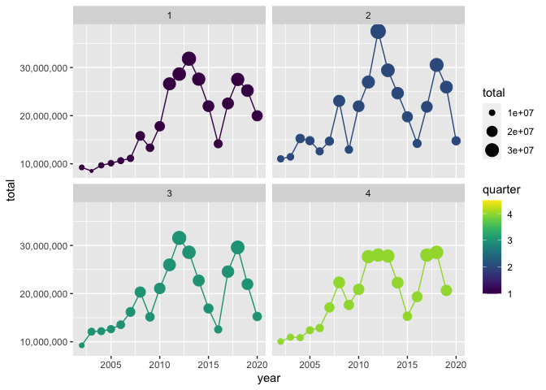

## Preliminaries: 

### Load libraries

It's a good idea to load your libraries at the top of the Rmd document so that everyone can see what you're using. Similarly, it's good practice to set `cache=FALSE` to ensure that the libraries are dynamically loaded each time you knit the document.

*Hint: I've only added the libraries needed to download and read the data. You'll need to load additional libraries to complete this assignment. Add them here once you discover that you need them.* 


```r
## Install the pacman package if necessary
if (!require("pacman")) install.packages("pacman")
## Install other packages using pacman::p_load()
pacman::p_load(httr, readxl, here, tidyverse, data.table, janitor, dplyr, viridis, ggthemes, RColorBrewer, gganimate, gifski, png)
```

### Read in the data

Use `httr::GET()` to fetch the EIA excel file for us from web. (We'll learn more about `httr`, GET and other HTTP methods when we get to webscraping next week.) 


```r
# library(here) ## Already loaded
# library(httr) ## Already loaded
url = "https://www.eia.gov/coal/archive/coal_historical_exports.xlsx"
## Only download the file if we need to
if(!file.exists(here::here("data/coal.xlsx"))) {
  GET(url, write_disk(here::here("data/coal.xlsx")))
}
```

```
## Response [https://www.eia.gov/coal/archive/coal_historical_exports.xlsx]
##   Date: 2021-01-31 19:59
##   Status: 200
##   Content-Type: application/vnd.openxmlformats-officedocument.spreadsheetml.sheet
##   Size: 785 kB
## <ON DISK>  /Users/Bazzle/Documents/607 Data Sci Projects/assignment-2-data-wrangling-jbazzle/data/coal.xlsx
```

Next, we read in the file.


```r
# library(readxl) Already loaded
coal = read_excel(here::here("data/coal.xlsx"), skip=3, na=".")
```

We are now ready to go.

## 1) Clean the column names

The column (i.e. variable) names aren't great: Spacing, uppercase letters, etc. 

```r
coal = clean_names(coal)
  
names(coal)
```

```
##  [1] "year"                     "quarter"                 
##  [3] "type"                     "customs_district"        
##  [5] "coal_origin_country"      "coal_destination_country"
##  [7] "steam_coal"               "steam_revenue"           
##  [9] "metallurgical"            "metallurgical_revenue"   
## [11] "total"                    "total_revenue"           
## [13] "coke"                     "coke_revenue"
```

Clean them. 

*Hint: Use either `gsub()` and regular expressions or, more simply, the `janitor()` package. You will need to install the latter first.*


## 2) Total US coal exports over time (year only)

Plot the US's total coal exports over time by year ONLY. What secular trends do you notice in the data?

*Hints: If you want nicely formatted y-axis label, add `+ scale_y_continuous(labels = scales::comma)` to your `ggplot2` code.*


```r
unique(coal$coal_origin_country)
```

```
## [1] "United States"
```

```r
## This is all export data, so that's cool

##multiple observations per year/total is region total
##note to future self: aggregate doesn't play nice with NA littered data, apparently

coalyeartotals = coal %>% 
  group_by(year) %>% 
  summarize(sum(total, na.rm = T))

colnames(coalyeartotals) = c("year", "total")

coalyeartotals %>% 
  ggplot(mapping = aes(x= year, y = total)) +
  geom_point(color = "blue")+
  geom_line(color = "red")+
  scale_y_continuous(labels = scales::comma)
```

<!-- -->

**At first glance I thought there was a political trend because of the sudden rise in 2016, but that doesn't necessarily account for the increase between 2008-2012 and the fall between 2012-2016.  Attempts to find anything about domestic coal use from this period seem to be an excellent way to generate ad revenue for Politico whilst wading into their substance-free editorials written by right-wing hacks.**

**That being said, it seems like global demand has been steadily declining in most countries since 2012.  The largest outlier in that trend is China, which has significantly increased its coal use.  Coal exporters have struggled to increase exports to China because Oregon and Washington have blocked the construction of new export terminals due to obvious environmental concerns that would accompany both the terminal and the rail transport of coal.**

**In addition to the above, a bit more digging (and finally locating something from Reuters, which is thankfully still largely free from the influence of right-wing hack editorials) indicates that coal prices in Asia fell significantly between 2011-2016 and rose again between 2016-2018, which puts the graph into a sensible context.  Given India, Japan, and China are the countries buying the most US coal, such a price drop likely means that US coal was no longer able to compete in the region during this time frame, resulting in a significant fall in exports of US coal.**


## 3) Total US coal exports over time (year AND quarter)

Now do the same as the above, except aggregated quarter of year (2001Q1, 2002Q2, etc.). Do you notice any seasonality that was masked from the yearly averages?


```r
coalquartertotals = coal %>% 
  group_by(quarter, year) %>% 
  summarize(sum(total, na.rm = T))

colnames(coalquartertotals) = c("quarter", "year", "total")

coalquartertotals %>% 
  ggplot() +
  geom_point(aes(x = year, y = total, color = quarter, size = total))+
  geom_line(aes(x = year, y = total, color = quarter))+
  scale_y_continuous(labels = scales::comma)+
  scale_color_viridis(option = "D", limits = c(1, 4.5))+
  facet_wrap(~ quarter)
```

<!-- -->

```r
## Note for future self: coerce these god awful, incoherent, colorblind unfriendly pallets using limits = (interval)
```

*Hint: ggplot2 is going to want you to convert your quarterly data into actual date format before it plots nicely. (i.e. Don't leave it as a string.)*

**It looks like quarter 2 2012 was the actual export peak, and the fall began in quarter 3 2012.  Additionally, it looks like the most coal is generally exported in quarter 2**

## 4) Exports by destination country

### 4.1) Create a new data frame

Create a new data frame called `coal_country` that aggregates total exports by destination country (and quarter of year). Make sure you print the resulting data frame so that it appears in the knitted R markdown document.


```r
coal_country = coal %>% 
  group_by(year, quarter, coal_destination_country) %>% 
   summarize(sum(total, na.rm = T))

colnames(coal_country) = c("year", "quarter", "destination", "total")

coal_country
```

```
## # A tibble: 4,574 x 4
## # Groups:   year, quarter [75]
##     year quarter destination   total
##    <dbl>   <dbl> <chr>         <dbl>
##  1  2002       1 Algeria      129305
##  2  2002       1 Angola         5713
##  3  2002       1 Argentina     40159
##  4  2002       1 Australia       175
##  5  2002       1 Belgium      575556
##  6  2002       1 Brazil       709171
##  7  2002       1 Canada      2270612
##  8  2002       1 Chile           812
##  9  2002       1 China             0
## 10  2002       1 Colombia        703
## # … with 4,564 more rows
```

### 4.2) Inspect the data frame

It looks like some countries are missing data for a number of years and periods (e.g. Albania). Confirm that this is the case. What do you think is happening here?


```r
frequencytable = coal_country %>% plyr::count("destination")
frequencytable
```

```
##                                destination freq
## 1                                  Albania    1
## 2                                  Algeria   46
## 3                                  Andorra    1
## 4                                   Angola   43
## 5                                 Anguilla    1
## 6                      Antigua and Barbuda    2
## 7                                Argentina   72
## 8                                  Armenia    4
## 9                                    Aruba    7
## 10                               Australia   61
## 11                                 Austria   57
## 12                              Azerbaijan    6
## 13                                 Bahamas   27
## 14                                 Bahrain    1
## 15                              Bangladesh    5
## 16                                Barbados    6
## 17                                 Belgium   75
## 18                                  Belize    4
## 19                                   Benin    1
## 20                                 Bermuda   27
## 21                                 Bolivia   23
## 22                  Bosnia and Herzegovina   10
## 23                                  Brazil   75
## 24          British Indian Ocean Territory    1
## 25                  British Virgin Islands    3
## 26                                  Brunei   28
## 27                                Bulgaria   25
## 28                         Burma (Myanmar)    4
## 29                                Cambodia    4
## 30                                Cameroon   10
## 31                                  Canada   75
## 32                          Cayman Islands    5
## 33                Central African Republic    1
## 34                                   Chile   73
## 35                                   China   72
## 36                                Colombia   72
## 37                     Congo (Brazzaville)    7
## 38                        Congo (Kinshasa)    2
## 39                              Costa Rica   74
## 40                                 Croatia   62
## 41                                 Curacao    5
## 42                          Czech Republic    2
## 43              Denmark (Except Greenland)   24
## 44                                Dominica    4
## 45                      Dominican Republic   65
## 46                                 Ecuador   66
## 47                                   Egypt   73
## 48                             El Salvador   73
## 49                       Equatorial Guinea   11
## 50                                 Eritrea    1
## 51                                 Estonia    1
## 52                           Faroe Islands    2
## 53           Fedrated States of Micronesia    1
## 54                                 Finland   59
## 55                                  France   74
## 56     French Southern and Antarctic Lands    1
## 57                                   Gabon   39
## 58                                 Georgia    2
## 59            Germany, Federal Republic of   74
## 60                                   Ghana    7
## 61                               Gibraltar    3
## 62                                  Greece   18
## 63                                 Grenada    2
## 64                              Guadeloupe    2
## 65                               Guatemala   70
## 66                                  Guinea    1
## 67                                  Guyana    3
## 68                 Holy See (Vatican City)    1
## 69                                Honduras   59
## 70                               Hong Kong   26
## 71                                 Hungary   14
## 72                                 Iceland   57
## 73                                   India   73
## 74                               Indonesia   61
## 75                                    Iraq   10
## 76                                 Ireland   22
## 77                                  Israel   52
## 78                                   Italy   75
## 79                             Ivory Coast    9
## 80                                 Jamaica   52
## 81                                   Japan   75
## 82                                  Jordan   10
## 83                              Kazakhstan   23
## 84                                   Kenya    6
## 85                                  Kuwait    4
## 86                                  Latvia   18
## 87                                 Lebanon    6
## 88                                 Liberia    2
## 89                                   Libya   11
## 90                               Lithuania    1
## 91                              Luxembourg    2
## 92                              Madagascar    5
## 93                                Malaysia   60
## 94                                   Malta    6
## 95                                  Mexico   75
## 96                                Mongolia    1
## 97                              Montenegro    2
## 98                                 Morocco   62
## 99                              Mozambique    9
## 100                            Netherlands   75
## 101                   Netherlands Antilles   10
## 102                          New Caledonia    1
## 103                            New Zealand   41
## 104                              Nicaragua   10
## 105                                Nigeria   23
## 106                                 Norway   72
## 107                                   Oman   21
## 108                               Pakistan   47
## 109                                 Panama   69
## 110                               Paraguay    3
## 111                                   Peru   64
## 112                            Philippines   12
## 113                                 Poland   52
## 114                               Portugal   52
## 115                                  Qatar   15
## 116                                Romania   61
## 117                                 Russia   46
## 118                  Saint Kitts and Nevis    2
## 119                            Saint Lucia    6
## 120       Saint Vincent and the Grenadines    2
## 121                           Saudi Arabia   71
## 122                                Senegal    9
## 123                                 Serbia   34
## 124                              Singapore   73
## 125                           Sint Maarten    2
## 126                               Slovakia   37
## 127                               Slovenia   37
## 128                           South Africa   64
## 129        South Korea (Republic of Korea)   75
## 130                                  Spain   75
## 131                              Sri Lanka    1
## 132                               Suriname    6
## 133                                 Sweden   74
## 134                            Switzerland   32
## 135                                 Taiwan   72
## 136 Tanzania (United Republic of Tanzania)    3
## 137                               Thailand   73
## 138                                   Togo   14
## 139                    Trinidad and Tobago   70
## 140                                Tunisia    7
## 141                                 Turkey   75
## 142                           Turkmenistan    2
## 143               Turks and Caicos Islands    1
## 144                                 Uganda    1
## 145                                Ukraine   54
## 146                   United Arab Emirates   55
## 147                         United Kingdom   75
## 148                                Uruguay   45
## 149                              Venezuela   71
## 150                                Vietnam   36
## 151                          Western Samoa    1
```

**Based only on the first page output (conveniently containing Albania), it is clear that the frequency with which countries appear in the data varies significantly.  A reasonable explanation, I would think, is that exporters are not consistently exporting to every country on the list during every quarter of every year.  Albania, for instance, only imported US coal once**

### 4.3) Complete the data frame

Fill in the implicit missing values, so that each country has a representative row for every year-quarter time period. In other words, you should modify the data frame so that every destination country has row entries for all possible year-quarter combinations (from 2002Q1 through the most recent quarter). Order your updated data frame by country, year and, quarter. 


```r
coal_country = coal_country %>%  ungroup() %>% 
  complete(quarter, year, destination, fill = list(total = 0))

coal_country
```

```
## # A tibble: 11,476 x 4
##    quarter  year destination          total
##      <dbl> <dbl> <chr>                <dbl>
##  1       1  2002 Albania                  0
##  2       1  2002 Algeria             129305
##  3       1  2002 Andorra                  0
##  4       1  2002 Angola                5713
##  5       1  2002 Anguilla                 0
##  6       1  2002 Antigua and Barbuda      0
##  7       1  2002 Argentina            40159
##  8       1  2002 Armenia                  0
##  9       1  2002 Aruba                    0
## 10       1  2002 Australia              175
## # … with 11,466 more rows
```

**make sure that worked...**


```r
frequencytable2 = coal_country %>% plyr::count("destination")
frequencytable2
```

```
##                                destination freq
## 1                                  Albania   76
## 2                                  Algeria   76
## 3                                  Andorra   76
## 4                                   Angola   76
## 5                                 Anguilla   76
## 6                      Antigua and Barbuda   76
## 7                                Argentina   76
## 8                                  Armenia   76
## 9                                    Aruba   76
## 10                               Australia   76
## 11                                 Austria   76
## 12                              Azerbaijan   76
## 13                                 Bahamas   76
## 14                                 Bahrain   76
## 15                              Bangladesh   76
## 16                                Barbados   76
## 17                                 Belgium   76
## 18                                  Belize   76
## 19                                   Benin   76
## 20                                 Bermuda   76
## 21                                 Bolivia   76
## 22                  Bosnia and Herzegovina   76
## 23                                  Brazil   76
## 24          British Indian Ocean Territory   76
## 25                  British Virgin Islands   76
## 26                                  Brunei   76
## 27                                Bulgaria   76
## 28                         Burma (Myanmar)   76
## 29                                Cambodia   76
## 30                                Cameroon   76
## 31                                  Canada   76
## 32                          Cayman Islands   76
## 33                Central African Republic   76
## 34                                   Chile   76
## 35                                   China   76
## 36                                Colombia   76
## 37                     Congo (Brazzaville)   76
## 38                        Congo (Kinshasa)   76
## 39                              Costa Rica   76
## 40                                 Croatia   76
## 41                                 Curacao   76
## 42                          Czech Republic   76
## 43              Denmark (Except Greenland)   76
## 44                                Dominica   76
## 45                      Dominican Republic   76
## 46                                 Ecuador   76
## 47                                   Egypt   76
## 48                             El Salvador   76
## 49                       Equatorial Guinea   76
## 50                                 Eritrea   76
## 51                                 Estonia   76
## 52                           Faroe Islands   76
## 53           Fedrated States of Micronesia   76
## 54                                 Finland   76
## 55                                  France   76
## 56     French Southern and Antarctic Lands   76
## 57                                   Gabon   76
## 58                                 Georgia   76
## 59            Germany, Federal Republic of   76
## 60                                   Ghana   76
## 61                               Gibraltar   76
## 62                                  Greece   76
## 63                                 Grenada   76
## 64                              Guadeloupe   76
## 65                               Guatemala   76
## 66                                  Guinea   76
## 67                                  Guyana   76
## 68                 Holy See (Vatican City)   76
## 69                                Honduras   76
## 70                               Hong Kong   76
## 71                                 Hungary   76
## 72                                 Iceland   76
## 73                                   India   76
## 74                               Indonesia   76
## 75                                    Iraq   76
## 76                                 Ireland   76
## 77                                  Israel   76
## 78                                   Italy   76
## 79                             Ivory Coast   76
## 80                                 Jamaica   76
## 81                                   Japan   76
## 82                                  Jordan   76
## 83                              Kazakhstan   76
## 84                                   Kenya   76
## 85                                  Kuwait   76
## 86                                  Latvia   76
## 87                                 Lebanon   76
## 88                                 Liberia   76
## 89                                   Libya   76
## 90                               Lithuania   76
## 91                              Luxembourg   76
## 92                              Madagascar   76
## 93                                Malaysia   76
## 94                                   Malta   76
## 95                                  Mexico   76
## 96                                Mongolia   76
## 97                              Montenegro   76
## 98                                 Morocco   76
## 99                              Mozambique   76
## 100                            Netherlands   76
## 101                   Netherlands Antilles   76
## 102                          New Caledonia   76
## 103                            New Zealand   76
## 104                              Nicaragua   76
## 105                                Nigeria   76
## 106                                 Norway   76
## 107                                   Oman   76
## 108                               Pakistan   76
## 109                                 Panama   76
## 110                               Paraguay   76
## 111                                   Peru   76
## 112                            Philippines   76
## 113                                 Poland   76
## 114                               Portugal   76
## 115                                  Qatar   76
## 116                                Romania   76
## 117                                 Russia   76
## 118                  Saint Kitts and Nevis   76
## 119                            Saint Lucia   76
## 120       Saint Vincent and the Grenadines   76
## 121                           Saudi Arabia   76
## 122                                Senegal   76
## 123                                 Serbia   76
## 124                              Singapore   76
## 125                           Sint Maarten   76
## 126                               Slovakia   76
## 127                               Slovenia   76
## 128                           South Africa   76
## 129        South Korea (Republic of Korea)   76
## 130                                  Spain   76
## 131                              Sri Lanka   76
## 132                               Suriname   76
## 133                                 Sweden   76
## 134                            Switzerland   76
## 135                                 Taiwan   76
## 136 Tanzania (United Republic of Tanzania)   76
## 137                               Thailand   76
## 138                                   Togo   76
## 139                    Trinidad and Tobago   76
## 140                                Tunisia   76
## 141                                 Turkey   76
## 142                           Turkmenistan   76
## 143               Turks and Caicos Islands   76
## 144                                 Uganda   76
## 145                                Ukraine   76
## 146                   United Arab Emirates   76
## 147                         United Kingdom   76
## 148                                Uruguay   76
## 149                              Venezuela   76
## 150                                Vietnam   76
## 151                          Western Samoa   76
```
*Hints: See `?tidyr::complete()` for some convenience options. Again, don't forget to print `coal_country` after you've updated the data frame so that I can see the results.*

### 4.4 Some more tidying up

In answering the previous question, you _may_ encounter a situation where the data frame contains a quarter --- probably 2020q4 --- that is missing total export numbers for *all* countries. Did this happen to you? Filter out the completely missing quarter if so. Also: Why do you think this might have happened? (Please answer the latter question even if it didn't happen to you.) 


```r
gsub("\\.", "q", lubridate::quarter(Sys.Date()-months(3), with_year = TRUE))
```

```
## [1] "2020q4"
```

**Complete() is finding all possible combinations of quarter, year, and destination.  We don't have data for 2020q4 in the data set, but 2020q4 is a possible combination, so when the complete function ran it generated rows for it.**


```r
coal_country = coal_country %>% 
  filter(!(year == 2020 & quarter == 4))

coal_country
```

```
## # A tibble: 11,325 x 4
##    quarter  year destination          total
##      <dbl> <dbl> <chr>                <dbl>
##  1       1  2002 Albania                  0
##  2       1  2002 Algeria             129305
##  3       1  2002 Andorra                  0
##  4       1  2002 Angola                5713
##  5       1  2002 Anguilla                 0
##  6       1  2002 Antigua and Barbuda      0
##  7       1  2002 Argentina            40159
##  8       1  2002 Armenia                  0
##  9       1  2002 Aruba                    0
## 10       1  2002 Australia              175
## # … with 11,315 more rows
```

**Looks like it is fixed now**

### 4.5) Culmulative top 10 US coal export destinations

Produce a vector --- call it `coal10_culm` --- of the top 10 top coal destinations over the full min(coal$year, na.rm=T)--\r max(coal$year, na.rm=T))` study period. What are they?


```r
coal_cum = coal_country %>% 
  group_by(destination) %>% 
   summarize(sum(total, na.rm = T))

colnames(coal_cum) = c("destination", "total")

coal_cum = coal_cum[order(-coal_cum$total),]

coal_culm = coal_cum[1:10, 1]

coal_culm
```

```
## # A tibble: 10 x 1
##    destination                    
##    <chr>                          
##  1 Canada                         
##  2 Netherlands                    
##  3 Brazil                         
##  4 India                          
##  5 South Korea (Republic of Korea)
##  6 United Kingdom                 
##  7 Japan                          
##  8 Italy                          
##  9 Germany, Federal Republic of   
## 10 Mexico
```
**The country list above represents the top ten buyers of US coals over the entire period.**

### 4.6) Recent top 10 US coal export destinations

Now do the same, except for most recent period on record (i.e. final quarter in the dataset). Call this vector `coal10_recent` and make sure to print it so that I can see it too. Are there any interesting differences between the two vectors? Apart from any secular trends, what else might explain these differences?


```r
coal_recent = coal_country %>% 
  filter((year == 2020 & quarter == 3))


coal10_recent = coal_recent[order(-coal_recent$total),]

coal10_recent = coal10_recent[1:10, 3]

coal10_recent
```

```
## # A tibble: 10 x 1
##    destination                    
##    <chr>                          
##  1 India                          
##  2 Brazil                         
##  3 Netherlands                    
##  4 Canada                         
##  5 Japan                          
##  6 South Korea (Republic of Korea)
##  7 Turkey                         
##  8 Ukraine                        
##  9 Dominican Republic             
## 10 Austria
```
**Many of the differences are not surprising (Germany and the UK not being in the top ten, India being at the top).  Ukraine being in the top ten is pretty interesting.  I imagine they've shifted a fair portion of their energy dependence to the US in light of their closest trading partner launching an invasion and annexing part of their territory.  I also would have thought that Japan and South Korea would have been on a similar trajectory to the UK and Germany in terms of coal use, but this serves as evidence that assumption may not be correct.**


### 4.7) US coal exports over time by country

Plot the quarterly coal exports over time, but now disaggregated by country. In particular, highlight the top 10 (cumulative) export destinations and then sum the remaining countries into a combined "Other" category. (In other words, your figure should contain the time series of eleven different countries/categories.)


```r
coalbycountry = coal_country

coalbycountry$destination = ifelse(coalbycountry$destination %in% coal_culm$destination, coalbycountry$destination, "Other")

coalbycountry = coalbycountry %>% 
  group_by(year, destination) %>% 
  summarize(sum(total, na.rm = T))

colnames(coalbycountry) = c("year", "destination", "total")

coalbycountry %>% 
  ggplot() +
  geom_point(aes(x = year, y = total, color = destination))+
  geom_line(aes(x = year, y = total, color = destination))+
  scale_y_continuous(labels = scales::comma)+
  scale_color_viridis(discrete = T, option = "D")
```

<!-- -->
**As someone that loves pasta, let me be the first to say that this spaghetti looks disgusting**

### 4.8) Make it pretty

Take your previous plot and add some swag to it. That is, try to make it as visually appealing as possible without overloading it with chart junk.


```r
coalbycountry$destination = factor(coalbycountry$destination, levels = c("Other", "Canada", "Netherlands", "Brazil", "India", "South Korea (Republic of Korea)", "United Kingdom", "Japan", "Italy", "Germany, Federal Republic of", "Mexico"))

coalbycountry %>% 
  ggplot(aes(x = year, y = total, fill = destination)) +
  geom_area()+
  scale_y_continuous(labels = scales::comma)+
  scale_fill_viridis(discrete = T, option = "cividis")+
  ggtitle("Top Importers of US Coal 2002-Present")+
  xlab("Year")+
  ylab("Tons of Coal")+
  theme_igray()
```

<!-- -->

*Hint: You've got loads of options here. If you haven't already done so, consider a more bespoke theme with the `ggthemes`, `hrbrthemes`, or `cowplot` packages. Try out `scale_fill_brewer()` and `scale_colour_brewer()` for a range of interesting colour palettes. Try some transparency effects with `alpha`. Give your axis labels more refined names with the `labs()` layer in ggplot2. While you're at it, you might want to scale (i.e. normalise) your y-variable to get rid of all those zeros. You can shorten any country names to their ISO abbreviation; see `?countrycode::countrycode`. More substantively --- but more complicated --- you might want to re-order your legend (and the plot itself) according to the relative importance of the destination countries. See `?forcats::fct_reorder` or forcats::fct_relevel`.*

**To me, a stacked-area representation is a lot more coherent.  Lasagna does tend to be a bit more appealing than spaghetti, after all**

### 4.9) Make it interactive

Create an interactive version of your previous figure.

*Hint: Take a look at plotly::ggplotly(), or the gganimate package.*


```r
test = coalbycountry %>% 
  ggplot(aes(x = year, y = total, color = destination, size = total)) +
  geom_point(alpha = .7)+
  scale_y_continuous(labels = scales::comma)+
  scale_fill_viridis(discrete = T, option = "cividis")+
  theme_minimal()+
  labs(title = 'year:{frame_time}', x = 'Year', y = 'Tons of Coal')+
  transition_time(year)+
  ease_aes('linear')

animate(test)
```

<!-- -->


## 5) Show me something interesting

There's a lot still to explore with this data set. Your final task is to show me something interesting. Drill down into the data and explain what's driving the secular trends that we have observed above. Or highlight interesting seasonality within a particular country. Or go back to the original `coal` data frame and look at exports by customs district, or by coal type. Do we changes or trends there? Etcetera. Etcetera. My only requirement is that you show your work and tell me what you have found.
